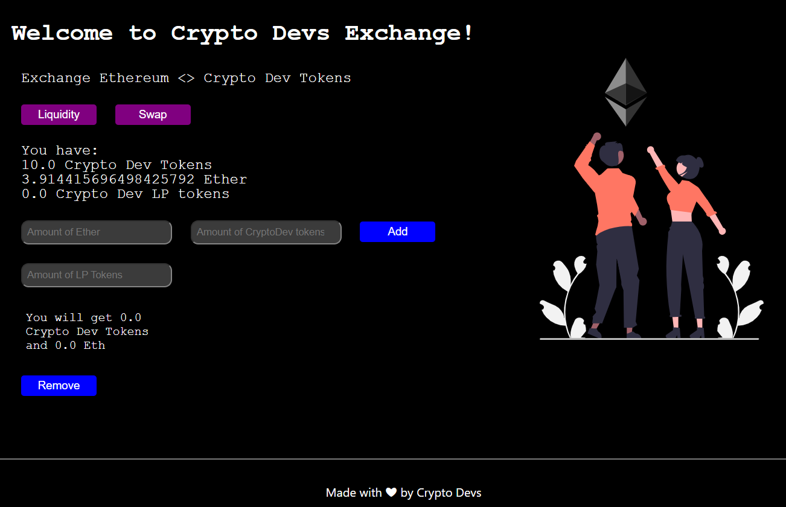
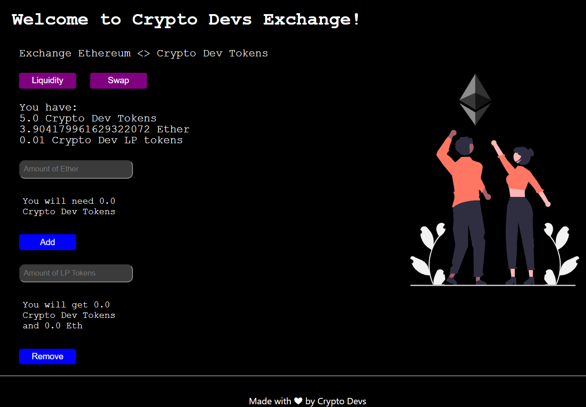
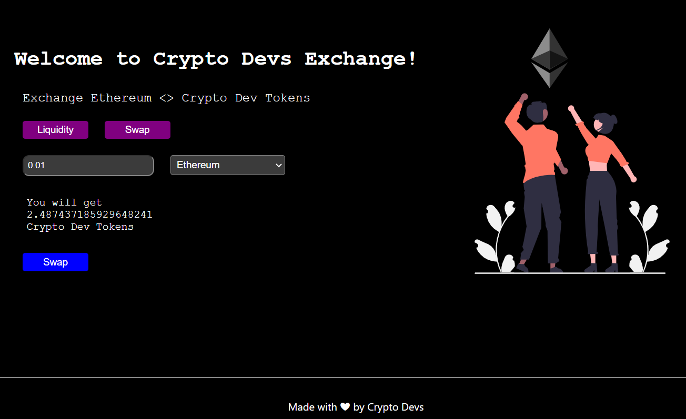

# Build your own Decentralized Exchange like Uniswap

This repo contains coursework project from [LearnWeb3](https://learnweb3.io/) completed by [0xsenzel](https://github.com/0xSenzel/) for [LearnWeb3DAO-Sophomore](https://learnweb3.io/courses/c1d7081b-63a9-4c6e-b35c-9fcbbad418b2) lesson.

## Project Info

Simulates Uniswap. Collects 1% fee for each swap. DEX also allows users to add liquidity of token minted from our ICO Dapp and ETH. Users will be given Crypto Dev LP tokens (Liquidity Provider Tokens).

## Project Demo

<figure>

<p align="center">Fig.1 - Home Page</p>
</figure>

<br/>

<figure>

<p align="center">Fig.2 - After Adding Liquidity</p>
</figure>

<br/>

<figure>

<p align="center">Fig.3 - Swap Tab</p>
</figure>

## Project Setup

### Hardhat

Head to [hardhat-tutorial](./hardhat-tutorial/) folder:

Install dependencies

```
npm install
```

Compile smart contract

```
npx hardhat compile
```

To deploy smart contracts: <br/>
Head to [hardhat.config.js](./hardhat-tutorial/hardhat.config.js) file, change the value of:

- `ALCHEMY_HTTP_URL` with your own Ethereum Network API
- `PRIVATE_KEY` with your Ethereum wallet's private key
- `API_KEY` with your Etherscan's API Key

Then run the following command.

```
npx hardhat run scripts/deploy.js --network goerli
npx hardhat verify --network goerli YOUR_SMARTCONTRACT_ADDRESS "CONSTRUCTOR ARG1" "CONSTRUCTOR ARG2"
```

### React & Next Js

Head to [my-app](./my-app/) folder:

```
npm install
```

Replace the variable inside [this folder](./my-app/constants/index.js):

- `TOKEN_CONTRACT_ADDRESS` with compiled ABI of [ICO](https://0xsenzel-ico.vercel.app/) contract.
- `TOKEN_CONTRACT_ABI` with deployed contract of [ICO](https://0xsenzel-ico.vercel.app/) contract.
- `EXCHANGE_CONTRACT_ADDRESS` with deployed contract of this contract
- `EXCHANGE_CONTRACT_ABI ` with compiled ABI of this contract

To run the app locally:

```
npm run dev
```
